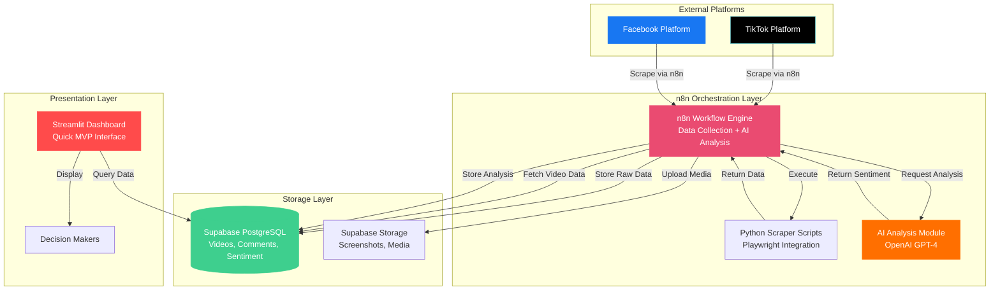
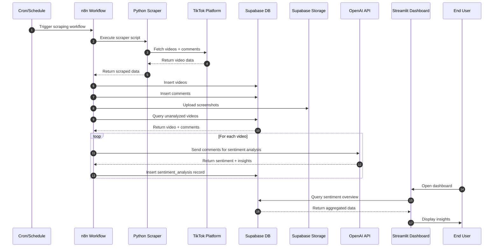
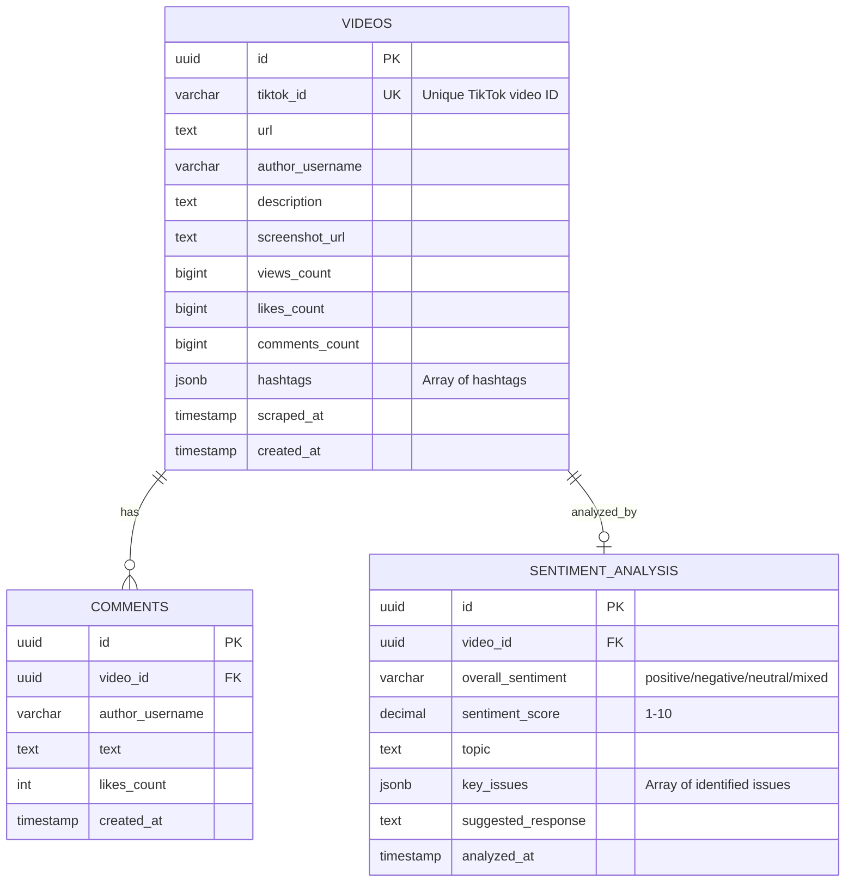
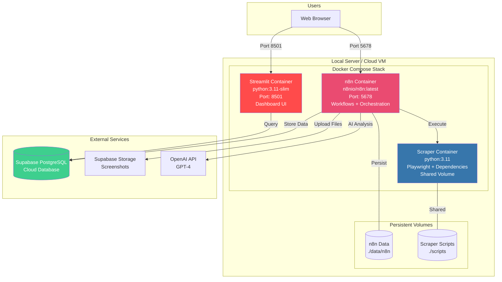

# Project S - MVP Architecture (Proof of Concept)

> **Simplified architecture** using n8n as the central orchestration layer for both data collection and AI analysis. This MVP removes complex scaling infrastructure to focus on core functionality validation.

## Table of Contents

1. [MVP System Architecture](#1-mvp-system-architecture)
2. [Simplified Data Flow](#2-simplified-data-flow)
3. [Database Schema](#3-database-schema)
4. [n8n Workflow Architecture](#4-n8n-workflow-architecture)
5. [Docker Deployment](#5-docker-deployment-mvp)
6. [Technology Stack](#6-technology-stack-mvp)
7. [Implementation Guide](#7-implementation-guide)

---

## 1. MVP System Architecture

Simplified architecture with n8n as the central orchestrator for scraping and AI analysis.



### Key Simplifications

| Component | Full Stack | MVP Version |
|-----------|-----------|-------------|
| **API Layer** | FastAPI + WebSocket | Direct Supabase queries from Streamlit |
| **Frontend** | React + Tailwind | Streamlit (Python-based) |
| **Orchestration** | n8n + Celery + Redis | n8n only |
| **Caching** | Redis | None (direct DB queries) |
| **AI/ML** | OpenAI + Local LLM + RAG | OpenAI GPT-4 only |
| **Deployment** | Multi-container Docker + GPU | Simple 3-container setup |

---

## 2. Simplified Data Flow

Sequential workflow showing n8n orchestrating both scraping and analysis.



### Workflow Stages

1. **Stage 1: Data Collection** (n8n workflow)
   - Trigger: Cron schedule (hourly/daily)
   - Execute Python scraper
   - Store videos, comments, screenshots

2. **Stage 2: AI Analysis** (same n8n workflow, next step)
   - Query unanalyzed videos from DB
   - Send to OpenAI for sentiment analysis
   - Store results back to DB

3. **Stage 3: Visualization** (Streamlit)
   - User opens dashboard
   - Direct query from Supabase
   - Display results

---

## 3. Database Schema

Same schema as full version, optimized for MVP.



### Removed Tables (for MVP)
- `constituencies` - Can be added later
- `scraping_jobs` - n8n handles job tracking
- `users` - No authentication in MVP

---

## 4. n8n Workflow Architecture

n8n workflow design showing dual-purpose orchestration.

```mermaid
graph TD
    Start[Cron Trigger<br/>Schedule: Every 6 hours]

    Start --> Scrape[Execute Python Script<br/>Scrape TikTok]

    Scrape --> ParseData[Parse Scraper Output<br/>JSON Data]

    ParseData --> CheckVideos{Videos<br/>Found?}
    CheckVideos -->|No| EndFail[End: No Data]
    CheckVideos -->|Yes| LoopVideos[Loop Through Videos]

    LoopVideos --> InsertVideo[Supabase: Insert Video<br/>Table: videos]
    InsertVideo --> UploadScreenshot[Supabase Storage<br/>Upload Screenshot]

    UploadScreenshot --> LoopComments[Loop Through Comments]
    LoopComments --> InsertComment[Supabase: Insert Comment<br/>Table: comments]

    InsertComment --> NextVideo{More<br/>Videos?}
    NextVideo -->|Yes| LoopVideos
    NextVideo -->|No| QueryUnanalyzed

    QueryUnanalyzed[Supabase: Query<br/>Unanalyzed Videos] --> LoopAnalysis[Loop Analysis]

    LoopAnalysis --> FetchComments[Supabase: Get Comments<br/>For Video]
    FetchComments --> BuildPrompt[Build Analysis Prompt<br/>Include Comments]

    BuildPrompt --> CallOpenAI[OpenAI API<br/>GPT-4 Sentiment Analysis]
    CallOpenAI --> ParseSentiment[Parse AI Response<br/>Extract Sentiment Data]

    ParseSentiment --> InsertAnalysis[Supabase: Insert<br/>sentiment_analysis]

    InsertAnalysis --> NextAnalysis{More<br/>Videos?}
    NextAnalysis -->|Yes| LoopAnalysis
    NextAnalysis -->|No| EndSuccess[End: Success]

    style Start fill:#EA4B71,color:#fff
    style Scrape fill:#3776AB,color:#fff
    style CallOpenAI fill:#FF6F00,color:#fff
    style InsertVideo fill:#3ECF8E,color:#fff
    style InsertComment fill:#3ECF8E,color:#fff
    style InsertAnalysis fill:#3ECF8E,color:#fff
    style EndSuccess fill:#4CAF50,color:#fff
    style EndFail fill:#F44336,color:#fff
```



### n8n Nodes Required

1. **Cron Trigger** - Schedule workflow execution
2. **Execute Command** - Run Python scraper script
3. **Code Node** - Parse scraper JSON output
4. **Supabase Nodes** - Insert videos, comments, query data
5. **Supabase Storage** - Upload screenshots
6. **Loop Node** - Iterate through videos/comments
7. **OpenAI Node** - Sentiment analysis
8. **Code Node** - Parse AI response
9. **Error Handler** - Catch and log errors

---

## 5. Docker Deployment (MVP)

Minimal 3-container setup for quick deployment.



---

## 6. Technology Stack (MVP)

### Core Components
- **Orchestration**: n8n (workflow automation)
- **Scraping**: Python 3.11 + Playwright (existing)
- **Database**: Supabase PostgreSQL (managed)
- **Storage**: Supabase Storage (managed)
- **AI**: OpenAI GPT-4 API
- **Frontend**: Streamlit (Python-based)
- **Deployment**: Docker Compose

### Python Dependencies (MVP)
```
# Scraping
playwright==1.40.0
beautifulsoup4==4.12.2

# Database
supabase==2.3.0
python-dotenv==1.0.0

# AI
openai==1.6.1

# Dashboard
streamlit==1.29.0
pandas==2.1.4
plotly==5.18.0
```

### Removed from Full Stack
- ❌ FastAPI (API layer)
- ❌ Redis (caching)
- ❌ Celery (background jobs)
- ❌ React (complex frontend)
- ❌ Local LLM (GPU requirements)
- ❌ RAG System (complexity)
- ❌ Nginx (reverse proxy)
- ❌ ChromaDB (vector store)

---

## 7. Implementation Guide

### Step 1: Set Up Supabase

**Create Tables**:
```sql
-- Enable UUID extension
CREATE EXTENSION IF NOT EXISTS "uuid-ossp";

-- Videos table
CREATE TABLE videos (
    id UUID PRIMARY KEY DEFAULT uuid_generate_v4(),
    tiktok_id VARCHAR(255) UNIQUE NOT NULL,
    url TEXT NOT NULL,
    author_username VARCHAR(255),
    description TEXT,
    screenshot_url TEXT,
    views_count BIGINT DEFAULT 0,
    likes_count BIGINT DEFAULT 0,
    comments_count BIGINT DEFAULT 0,
    hashtags JSONB,
    scraped_at TIMESTAMP DEFAULT NOW(),
    created_at TIMESTAMP DEFAULT NOW()
);

-- Comments table
CREATE TABLE comments (
    id UUID PRIMARY KEY DEFAULT uuid_generate_v4(),
    video_id UUID REFERENCES videos(id) ON DELETE CASCADE,
    author_username VARCHAR(255),
    text TEXT NOT NULL,
    likes_count INT DEFAULT 0,
    created_at TIMESTAMP DEFAULT NOW()
);

-- Sentiment Analysis table
CREATE TABLE sentiment_analysis (
    id UUID PRIMARY KEY DEFAULT uuid_generate_v4(),
    video_id UUID REFERENCES videos(id) ON DELETE CASCADE,
    overall_sentiment VARCHAR(50),
    sentiment_score DECIMAL(3,1),
    topic TEXT,
    key_issues JSONB,
    suggested_response TEXT,
    analyzed_at TIMESTAMP DEFAULT NOW()
);

-- Create indexes for performance
CREATE INDEX idx_videos_tiktok_id ON videos(tiktok_id);
CREATE INDEX idx_comments_video_id ON comments(video_id);
CREATE INDEX idx_sentiment_video_id ON sentiment_analysis(video_id);
CREATE INDEX idx_videos_scraped_at ON videos(scraped_at DESC);
```

### Step 2: Create Docker Compose

**docker-compose.yml**:
```yaml
version: '3.8'

services:
  n8n:
    image: n8nio/n8n:latest
    container_name: projectS-n8n
    ports:
      - "5678:5678"
    environment:
      - N8N_BASIC_AUTH_ACTIVE=true
      - N8N_BASIC_AUTH_USER=admin
      - N8N_BASIC_AUTH_PASSWORD=${N8N_PASSWORD}
      - WEBHOOK_URL=http://localhost:5678/
    volumes:
      - ./data/n8n:/home/node/.n8n
      - ./scripts:/scripts:ro
    restart: unless-stopped

  streamlit:
    build:
      context: .
      dockerfile: Dockerfile.streamlit
    container_name: projectS-dashboard
    ports:
      - "8501:8501"
    environment:
      - SUPABASE_URL=${SUPABASE_URL}
      - SUPABASE_KEY=${SUPABASE_ANON_KEY}
    volumes:
      - ./dashboard:/app
    restart: unless-stopped

  scraper:
    build:
      context: .
      dockerfile: Dockerfile.scraper
    container_name: projectS-scraper
    environment:
      - SUPABASE_URL=${SUPABASE_URL}
      - SUPABASE_KEY=${SUPABASE_SERVICE_ROLE_KEY}
    volumes:
      - ./scripts:/scripts
      - ./scraper.py:/app/scraper.py
    command: tail -f /dev/null  # Keep container running
    restart: unless-stopped

networks:
  default:
    name: projectS-network
```

### Step 3: Create Dockerfiles

**Dockerfile.scraper**:
```dockerfile
FROM python:3.11-slim

WORKDIR /app

# Install system dependencies
RUN apt-get update && apt-get install -y \
    wget \
    gnupg \
    && rm -rf /var/lib/apt/lists/*

# Install Python dependencies
COPY requirements-scraper.txt .
RUN pip install --no-cache-dir -r requirements-scraper.txt

# Install Playwright browsers
RUN playwright install chromium
RUN playwright install-deps chromium

COPY scraper.py .
COPY scripts/ /scripts/

CMD ["tail", "-f", "/dev/null"]
```

**Dockerfile.streamlit**:
```dockerfile
FROM python:3.11-slim

WORKDIR /app

COPY requirements-dashboard.txt .
RUN pip install --no-cache-dir -r requirements-dashboard.txt

COPY dashboard/ .

EXPOSE 8501

CMD ["streamlit", "run", "app.py", "--server.port=8501", "--server.address=0.0.0.0"]
```

### Step 4: Create Streamlit Dashboard

**dashboard/app.py**:
```python
import streamlit as st
from supabase import create_client, Client
import pandas as pd
import plotly.express as px
import os
from datetime import datetime, timedelta

# Initialize Supabase
supabase: Client = create_client(
    os.getenv("SUPABASE_URL"),
    os.getenv("SUPABASE_KEY")
)

st.set_page_config(
    page_title="Project S - Sentiment Dashboard",
    page_icon="📊",
    layout="wide"
)

st.title("🎯 Project S - Political Sentiment Dashboard")
st.markdown("**Real-time analysis of Sarawak political discourse**")

# Sidebar filters
st.sidebar.header("Filters")
days_filter = st.sidebar.slider("Days to show", 1, 30, 7)
date_from = datetime.now() - timedelta(days=days_filter)

# Fetch data
@st.cache_data(ttl=300)  # Cache for 5 minutes
def get_sentiment_overview():
    response = supabase.table("sentiment_analysis") \
        .select("*, videos(*)") \
        .gte("videos.scraped_at", date_from.isoformat()) \
        .execute()
    return pd.DataFrame(response.data)

@st.cache_data(ttl=300)
def get_video_stats():
    response = supabase.table("videos") \
        .select("*") \
        .gte("scraped_at", date_from.isoformat()) \
        .execute()
    return pd.DataFrame(response.data)

# Load data
with st.spinner("Loading data..."):
    sentiment_df = get_sentiment_overview()
    videos_df = get_video_stats()

# Metrics row
col1, col2, col3, col4 = st.columns(4)

with col1:
    st.metric("Total Videos", len(videos_df))

with col2:
    st.metric("Videos Analyzed", len(sentiment_df))

with col3:
    avg_sentiment = sentiment_df["sentiment_score"].mean() if len(sentiment_df) > 0 else 0
    st.metric("Avg Sentiment", f"{avg_sentiment:.1f}/10")

with col4:
    total_views = videos_df["views_count"].sum()
    st.metric("Total Views", f"{total_views:,}")

# Sentiment distribution
st.subheader("📊 Sentiment Distribution")
if len(sentiment_df) > 0:
    sentiment_counts = sentiment_df["overall_sentiment"].value_counts()
    fig = px.pie(
        values=sentiment_counts.values,
        names=sentiment_counts.index,
        title="Overall Sentiment Breakdown"
    )
    st.plotly_chart(fig, use_container_width=True)
else:
    st.info("No sentiment data available yet.")

# Recent videos table
st.subheader("📹 Recent Videos")
if len(videos_df) > 0:
    display_df = videos_df[["author_username", "description", "views_count", "likes_count", "scraped_at"]] \
        .sort_values("scraped_at", ascending=False) \
        .head(10)
    st.dataframe(display_df, use_container_width=True)
else:
    st.info("No videos scraped yet.")

# Key issues
st.subheader("🔑 Key Issues Detected")
if len(sentiment_df) > 0 and "key_issues" in sentiment_df.columns:
    all_issues = []
    for issues in sentiment_df["key_issues"].dropna():
        if isinstance(issues, list):
            all_issues.extend(issues)

    if all_issues:
        issue_counts = pd.Series(all_issues).value_counts().head(10)
        fig = px.bar(
            x=issue_counts.values,
            y=issue_counts.index,
            orientation="h",
            title="Top Issues Discussed"
        )
        st.plotly_chart(fig, use_container_width=True)
else:
    st.info("No issues data available yet.")

# Auto-refresh
st.sidebar.markdown("---")
if st.sidebar.button("🔄 Refresh Data"):
    st.cache_data.clear()
    st.rerun()
```

### Step 5: Update .env File

Add to existing [.env](.env):
```env
# n8n
N8N_PASSWORD=your_secure_password_here

# OpenAI (for sentiment analysis)
OPENAI_API_KEY=your_openai_api_key_here
```

### Step 6: Create n8n Workflow

**Import this workflow JSON into n8n**:

Key nodes:
1. **Cron Trigger** → Schedule (every 6 hours)
2. **Execute Command** → Run: `docker exec projectS-scraper python /app/scraper.py --output /scripts/output.json`
3. **Read File** → `/scripts/output.json`
4. **Loop Over Items** → Videos
5. **Supabase Insert** → Videos table
6. **Supabase Storage** → Upload screenshot
7. **Loop Over Items** → Comments
8. **Supabase Insert** → Comments table
9. **Supabase Query** → Unanalyzed videos
10. **OpenAI Chat** → Sentiment analysis
11. **Supabase Insert** → Sentiment_analysis table

---

## Quick Start Commands

```bash
# 1. Clone and setup
cd tiktok-scraper

# 2. Create required directories
mkdir -p data/n8n scripts dashboard

# 3. Start services
docker-compose up -d

# 4. Access interfaces
# n8n: http://localhost:5678
# Dashboard: http://localhost:8501

# 5. View logs
docker-compose logs -f

# 6. Stop services
docker-compose down
```

---

## MVP Limitations & Future Enhancements

### Current Limitations
- ❌ No real-time updates (batch processing only)
- ❌ No user authentication
- ❌ No constituency mapping
- ❌ No bot detection
- ❌ No caching (slower queries)
- ❌ No advanced NLP (basic sentiment only)
- ❌ Limited scalability

### Path to Full Stack
Once MVP is validated:
1. Add FastAPI for proper API layer
2. Implement React dashboard for better UX
3. Add Redis for caching
4. Implement constituency mapping
5. Add local LLM with RAG
6. Scale to multi-container architecture

---

**MVP Timeline**: 1-2 weeks
**Full Stack Timeline**: 8-12 weeks

This MVP allows you to validate the concept and gather feedback before investing in the full infrastructure.
