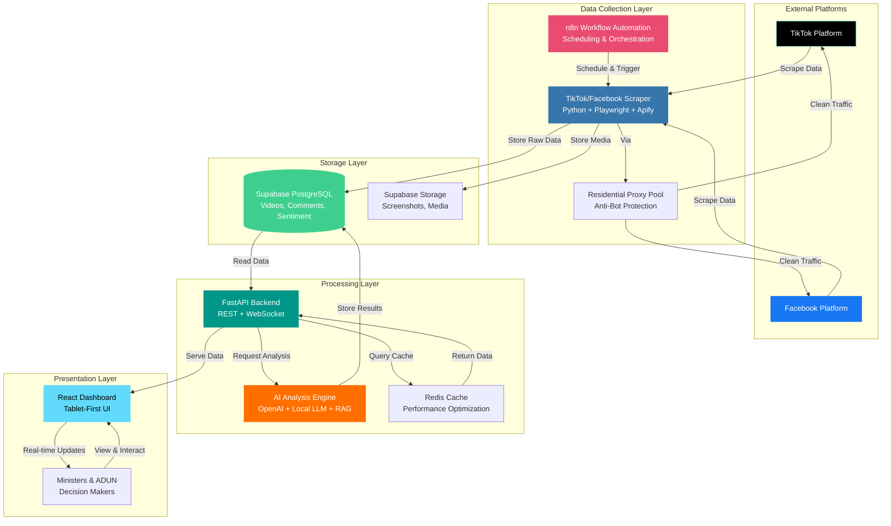
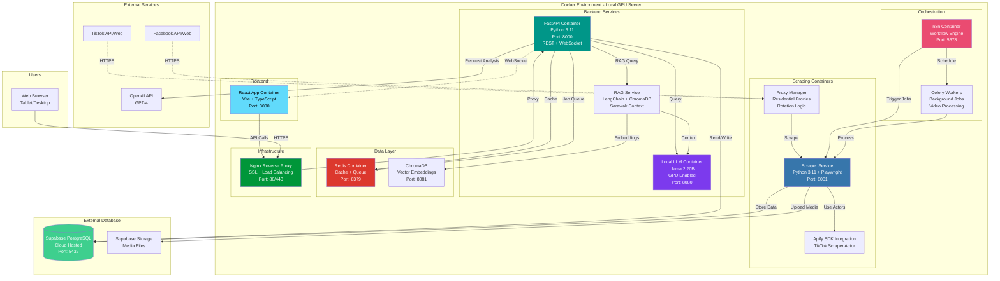
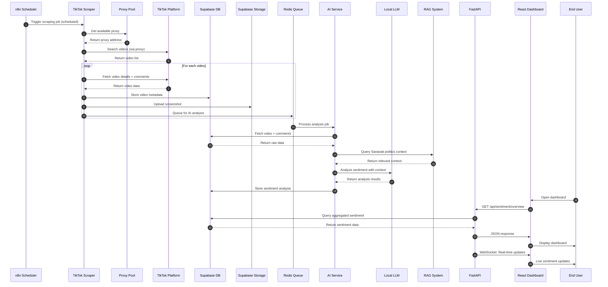
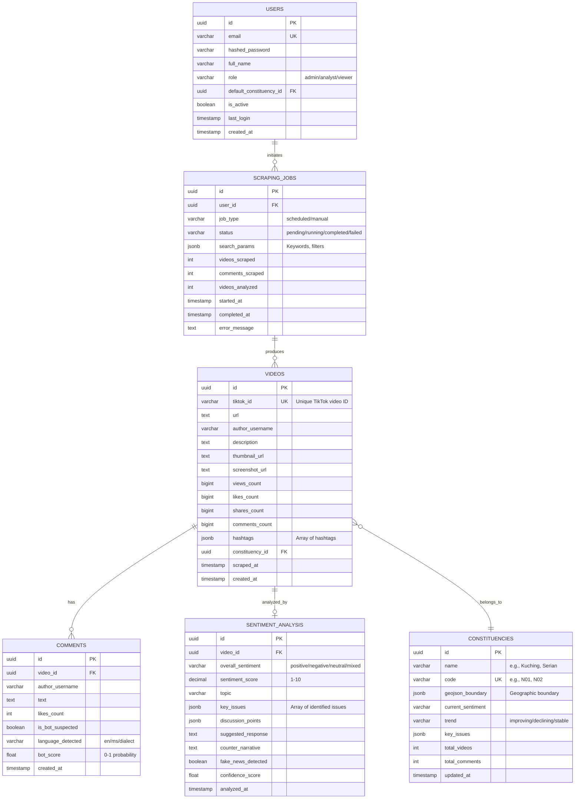
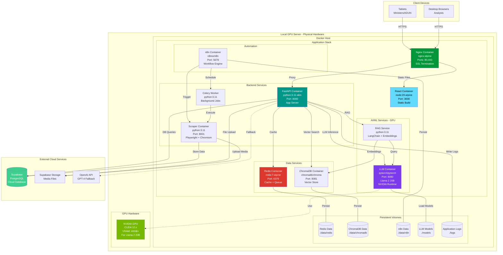
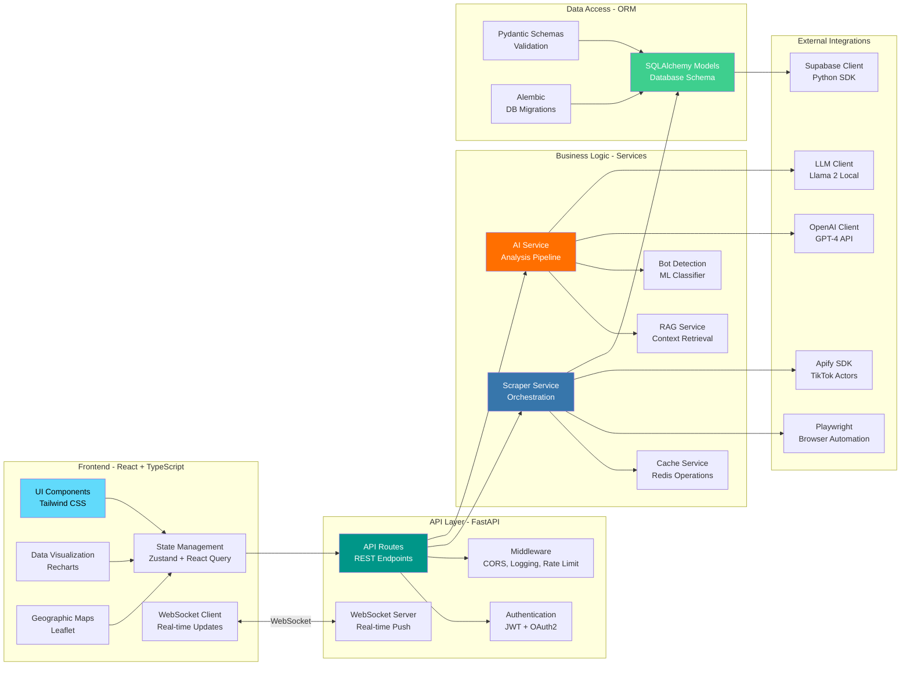

# Project S - System Architecture Documentation

> **Project S** is a political sentiment analysis platform for monitoring and analyzing public opinion on Sarawak politics through TikTok and Facebook data collection, AI-powered analysis, and an intuitive dashboard interface for decision-makers.

## Table of Contents

1. [High-Level System Architecture](#1-high-level-system-architecture)
2. [Detailed Technical Architecture](#2-detailed-technical-architecture)
3. [Data Flow Diagram](#3-data-flow-diagram)
4. [Database Schema](#4-database-schema)
5. [Docker Deployment Architecture](#5-docker-deployment-architecture)
6. [Component Architecture](#6-component-architecture)
7. [Technology Stack](#7-technology-stack)

---

## 1. High-Level System Architecture

This diagram provides a stakeholder-friendly overview of the main system components and data flow.

### Key Components

- **Data Collection Layer**: Automated scraping with anti-bot protection
- **Storage Layer**: Cloud-based PostgreSQL with file storage
- **Processing Layer**: API server with AI-powered analysis
- **Presentation Layer**: Intuitive dashboard for decision-makers

---

## 2. Detailed Technical Architecture

This diagram shows the complete Docker container architecture with all services and their relationships.

### Container Services

| Service | Technology | Port | Purpose |
|---------|-----------|------|---------|
| Nginx | nginx:alpine | 80, 443 | Reverse proxy & SSL termination |
| FastAPI | python:3.11-slim | 8000 | Main API server |
| Scraper | python:3.11 | 8001 | TikTok/Facebook scraping |
| LLM | pytorch/pytorch | 8080 | Local Llama 2 20B inference |
| RAG | python:3.11 | - | Context retrieval system |
| Redis | redis:7-alpine | 6379 | Cache & job queue |
| ChromaDB | chromadb/chroma | 8081 | Vector embeddings |
| n8n | n8nio/n8n | 5678 | Workflow automation |
| React | node:20-alpine | 3000 | Frontend dashboard |
| Celery | python:3.11 | - | Background workers |

---

## 3. Data Flow Diagram

This sequence diagram illustrates the complete data processing pipeline from scraping to visualization.

### Data Flow Steps

1. **Scheduled Trigger**: n8n triggers scraping jobs (hourly/daily)
2. **Proxy Rotation**: Scraper gets residential proxy to avoid detection
3. **Data Collection**: Scrape videos, comments, and metadata
4. **Storage**: Raw data stored in Supabase PostgreSQL
5. **Job Queue**: Analysis jobs queued in Redis
6. **AI Processing**: Sentiment analysis with RAG-enhanced LLM
7. **User Access**: Dashboard displays real-time insights

---

## 4. Database Schema

Entity Relationship Diagram showing all database tables and their relationships.

### Key Database Features

- **UUIDs**: Primary keys for distributed system compatibility
- **JSONB**: Flexible storage for hashtags, issues, and metadata
- **Indexing**: Optimized for constituency-based queries
- **Timestamps**: Audit trail for all data changes
- **Foreign Keys**: Referential integrity maintained

---

## 5. Docker Deployment Architecture

Comprehensive deployment diagram showing local GPU server infrastructure.

### Infrastructure Requirements

**Hardware**:
- NVIDIA GPU with 40GB+ VRAM (for Llama 2 20B)
- CUDA 12.x support
- Sufficient CPU/RAM for Docker containers

**Software**:
- Docker Engine with NVIDIA Container Runtime
- Docker Compose for multi-service orchestration
- SSL certificates for HTTPS

**Persistent Storage**:
- Redis data volume
- ChromaDB embeddings
- n8n workflow configurations
- LLM model weights
- Application logs

---

## 6. Component Architecture

Detailed breakdown of the technical stack and component interactions.

---

## 7. Technology Stack

### Frontend Layer
- **Framework**: React 18+ with TypeScript
- **Styling**: Tailwind CSS
- **State Management**: Zustand + React Query
- **Data Visualization**: Recharts
- **Maps**: Leaflet with React-Leaflet
- **Real-time**: WebSocket client
- **Build Tool**: Vite

### Backend Layer
- **API Framework**: FastAPI (Python 3.11+)
- **ORM**: SQLAlchemy 2.0
- **Validation**: Pydantic v2
- **Authentication**: JWT with FastAPI-Users
- **WebSocket**: FastAPI native WebSocket support
- **API Docs**: Auto-generated Swagger/OpenAPI

### Data Processing Layer
- **Scraping**: Playwright + Apify SDK
- **Orchestration**: n8n (workflow automation)
- **Caching**: Redis 7.x
- **Queue**: Celery with Redis backend
- **Proxy Management**: Custom proxy pool with rotation

### AI/ML Layer
- **Sentiment Analysis**: OpenAI GPT-4
- **Reasoning Model**: Llama 2 20B (local deployment)
- **RAG System**: LangChain + ChromaDB vector store
- **Language Support**: Custom dialect dictionary + translation layer
- **Bot Detection**: ML classifier (scikit-learn)

### Storage Layer
- **Primary Database**: Supabase PostgreSQL
- **Vector Database**: ChromaDB (for RAG embeddings)
- **File Storage**: Supabase Storage (images, videos, screenshots)
- **Cache**: Redis (query cache, session storage)

### Infrastructure Layer
- **Containerization**: Docker + Docker Compose
- **Reverse Proxy**: Nginx
- **GPU Runtime**: NVIDIA Docker runtime
- **Monitoring**: Prometheus + Grafana (optional)
- **Logs**: Structured logging with rotation

---

## Design Principles

Based on the Project S UI/UX requirements:

### 1. Single-Screen Comprehension
- Core insights visible upon launch
- No navigation required for situational awareness

### 2. Plain-Language Hierarchy
- Readable summaries over dense visualizations
- Clear, concise messaging

### 3. Minimal Interaction
- Reduce reliance on filters and hidden controls
- Proactive information display

### 4. Neutral Visual Tone
- Calm, dependable presentation
- Avoid urgency or alarm cues

### 5. Tablet-First Layout
- 16:9 optimized layout
- Touch-friendly interface
- Accessible to users 60+ years old

---

## Performance Targets

- **Scraping Capacity**: 10,000 videos per day
- **Real-time Updates**: WebSocket latency < 100ms
- **API Response**: < 200ms for cached queries
- **Dashboard Load**: < 2 seconds initial load
- **Sentiment Analysis**: < 30 seconds per video

---

## Security Considerations

1. **Authentication**: JWT-based with role-based access control
2. **Data Encryption**: SSL/TLS for all external connections
3. **API Security**: Rate limiting and CORS protection
4. **Proxy Protection**: Residential proxies to avoid platform bans
5. **Secrets Management**: Environment variables, no hardcoded credentials

---

## Future Enhancements

- Cloud failover deployment for power outage scenarios
- Multi-platform expansion (Instagram, YouTube)
- Advanced bot detection with neural networks
- Automated counter-narrative generation
- Mobile app for on-the-go access

---

**Last Updated**: December 2025
**Version**: 1.0
**Contact**: Project S Development Team
